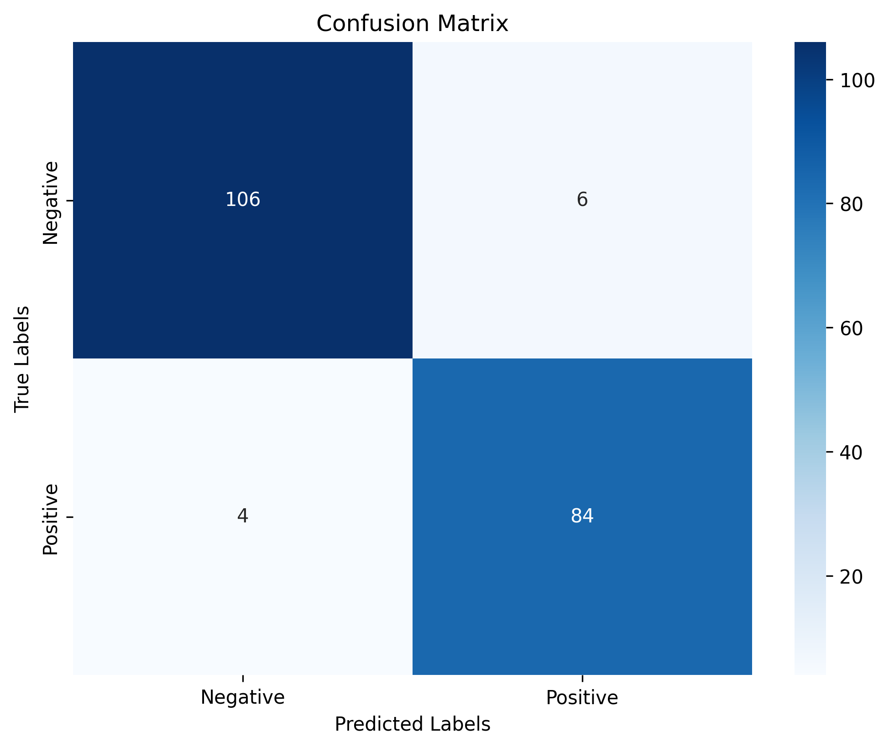
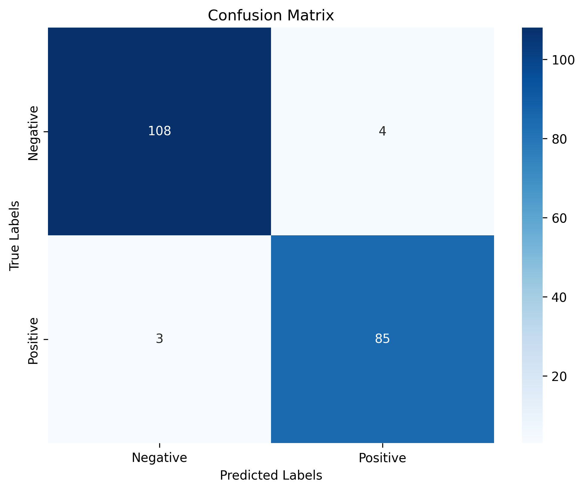

# FraudShield: Anomaly Detection Pipeline

[](https://opensource.org/licenses/MIT)
[](https://www.python.org/downloads/)
[](https://travis-ci.org/username/FraudShield)
[](https://coveralls.io/github/username/FraudShield)

FraudShield is an advanced anomaly detection pipeline designed to identify and prevent fraudulent activities within large datasets. By leveraging cutting-edge machine learning techniques, FraudShield ensures the integrity and security of financial transactions.

## Key Features

- Ingestion of large-scale transaction data from various sources
- Data cleaning and preprocessing using pandas and scikit-learn
- Advanced feature engineering techniques to extract relevant fraud indicators
- Training and evaluation of state-of-the-art machine learning models (Random Forest, XGBoost)
- Comprehensive model evaluation using multiple metrics (accuracy, precision, recall, F1 score, AUC)
- Seamless integration with SQL databases for data storage and retrieval
- Modular and scalable architecture for easy maintenance and extension
- Robust monitoring and alerting mechanisms for real-time fraud detection
- User-friendly interfaces for data exploration, model training, and results interpretation

## Installation

1. Clone the repository:
   ```
   git clone https://github.com/muditbhargava66/FraudShield.git
   cd FraudShield
   ```

2. Install the required dependencies:
   ```
   pip install -r requirements.txt
   ```

3. Set up the SQL database:
   - Create a new database for FraudShield.
   - Update the database connection details in the configuration file (`conf/database.ini`).
   - Run the SQL scripts in the `src/sql` directory to create the required tables and indexes.

4. Configure Apache Airflow:
   - Set up Airflow by following the official documentation: [Apache Airflow Documentation](https://airflow.apache.org/docs/apache-airflow/stable/start.html)
   - Update the Airflow configuration file (`airflow.cfg`) with the required settings.
   - Initialize the Airflow database and create an admin user.

5. Compile the C++ modules:
   ```
   cd src/data_cleaning
   g++ -O3 -o data_cleaning data_cleaning.cpp
   cd ../feature_engineering
   g++ -O3 -o feature_engineering feature_engineering.cpp
   ```

## Usage

### Part 1

1. Run the data ingestion script:
   ```
   python src/data_ingestion/data_ingestion.py
   ```

2. Run the data preprocessing script:
   ```
   python src/data_preprocessing/data_preprocessing.py --input_data /path/to/ingested_data.csv --train_data /path/to/preprocessed_data.npy --test_data /path/to/test_data.npy
   ```

3. Train the machine learning models:
   ```
   python src/model_training/train_models.py --preprocessed_data /path/to/preprocessed_data.npy --output_dir /path/to/models/
   ```

4. Evaluate the trained models:
   ```
   python src/model_evaluation/evaluation.py --model_path /path/to/trained_model.pkl --test_data /path/to/test_data.npy --output_path /path/to/evaluation_report.csv
   ```

### Part 2

1. Start the Airflow webserver and scheduler:
   ```
   airflow webserver --port 8080
   airflow scheduler
   ```

2. Access the Airflow web interface by navigating to `http://localhost:8080` in your web browser.

3. Enable the FraudShield DAG (Directed Acyclic Graph) in the Airflow web interface.

4. Trigger the DAG manually or wait for the scheduled run according to the configured schedule interval.

5. Monitor the pipeline execution in the Airflow web interface and check the logs for any errors or issues.

## Configuration

The FraudShield pipeline can be configured using the following files:

- `conf/database.ini`: Database connection settings.
- `conf/airflow.cfg`: Airflow configuration settings.
- `conf/pipeline.yaml`: Pipeline parameters and settings.

Modify these configuration files according to your specific requirements and environment setup.

## Documentation

Detailed documentation for FraudShield can be found in the `docs` directory:

- `docs/project_overview.md`: High-level overview of the FraudShield project.
- `docs/data_dictionary.md`: Description of the data fields and their characteristics.
- `docs/model_architecture.md`: Explanation of the machine learning models used in FraudShield.
- `docs/cpp_modules.md`: Documentation for the C++ modules used for data cleaning and feature engineering.
- `docs/sql_schema.md`: Description of the SQL database schema and data retrieval process.
- `docs/setup_instructions.md`: Step-by-step instructions for setting up FraudShield.

## Model Evaluation Results

The trained models were evaluated on a separate test dataset using various performance metrics. Here are the evaluation results for the Random Forest and XGBoost models:

### Random Forest Model


| Metric     | Value                |
|------------|----------------------|
| Accuracy   | 0.95                 |
| Precision  | 0.9333333333333333   |
| Recall     | 0.9545454545454546   |
| F1 Score   | 0.9438202247191011   |
| AUC        | 0.9864549512987013   |

### XGBoost Model


| Metric     | Value                |
|------------|----------------------|
| Accuracy   | 0.965                |
| Precision  | 0.9550561797752809   |
| Recall     | 0.9659090909090909   |
| F1 Score   | 0.96045197740113     |
| AUC        | 0.991984577922078    |

The confusion matrices provide a visual representation of the models' performance in terms of true positives, true negatives, false positives, and false negatives. The evaluation metrics demonstrate the high accuracy and effectiveness of both models in detecting fraudulent transactions.

## Contributing

Contributions to FraudShield are welcome! If you find any issues or have suggestions for improvements, please open an issue or submit a pull request. Make sure to follow the contribution guidelines outlined in [CONTRIBUTING.md](CONTRIBUTING.md).

## License

FraudShield is released under the [MIT License](LICENSE). Feel free to use, modify, and distribute the code as per the terms of the license.

## Contact

For any questions, suggestions, or feedback, please contact the FraudShield team at [muditbhargava66](muditbhargava66).

---